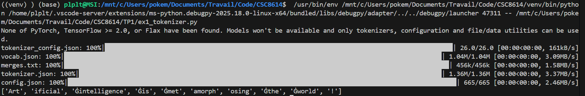
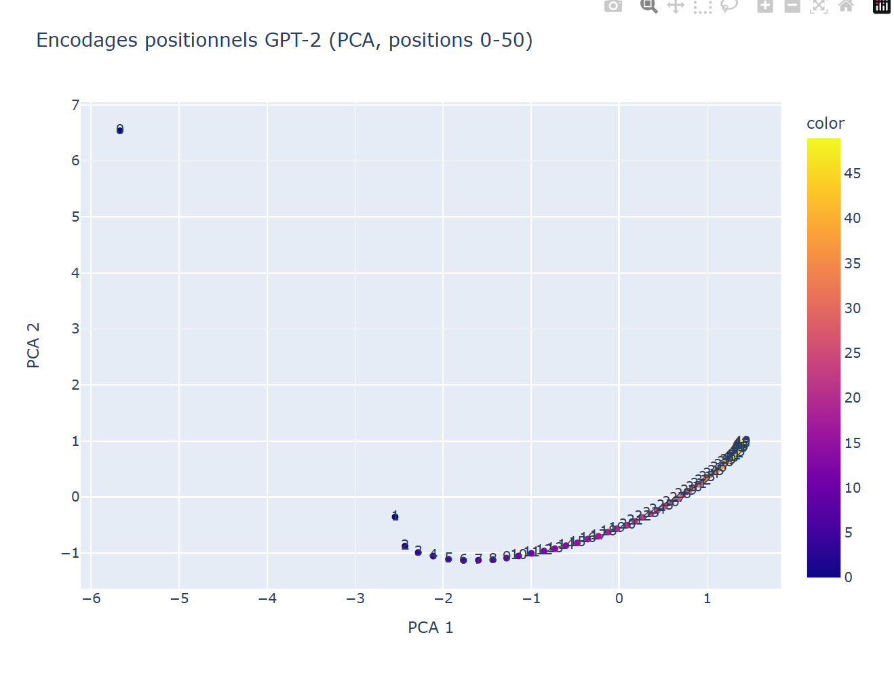
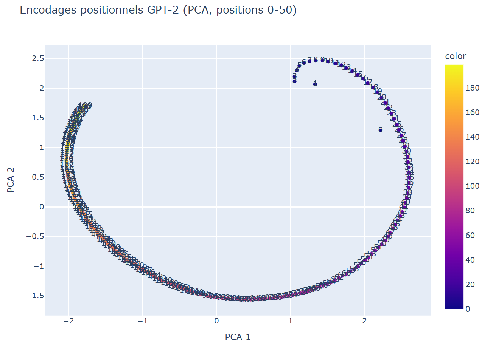
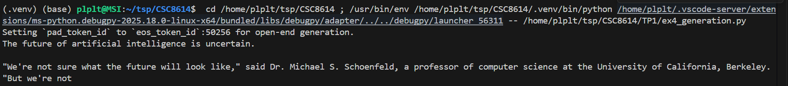

## CI4 : Modèles de langage

Dans ce TP, vous allez découvrir concrètement comment fonctionnent les modèles Transformers à travers la bibliothèque HuggingFace Transformers. Nous allons approfondir ensemble des notions fondamentales telles que la tokenisation, l'encodage positionnel, la génération de texte ainsi que les différentes méthodes de génération proposées par les modèles pré-entraînés comme GPT-2.

> ## Apparté installation et instructions
> Avant de commencer, ce tp est directement commplété à partir de l'énoncé initial, les réponses étant indiquées via la balise **"\>"**.
>
> Nom: Pillet
>
> Prénom: Pierlouis
>
> Commande d'installation/activation d'environnement:
> ```bash
> python -m venv venv
> source venv/bin/activate
> pip install -r TP1/requirements.txt
> ```


### Objectifs du TP :

*   Comprendre le processus de **tokenisation** et notamment la méthode **BPE (Byte Pair Encoding)**.
*   Visualiser et analyser le rôle des **encodages positionnels** dans un modèle Transformer.
*   Calculer des **probabilités** (et log-probabilités) de génération d'une phrase à partir d'un modèle GPT-2.
*   Expérimenter et comparer différentes **méthodes de génération** : décodage glouton, échantillonnage (top-k, top-p, température), recherche par faisceau (beam search).

Tout au long du TP, vous utiliserez des exemples pratiques et effectuerez des expérimentations pour renforcer votre compréhension.

### Rendu (GitHub) et rapport Markdown — à lire avant de commencer

Pour ce TP, vous rendrez un dépôt GitHub contenant à la fois le code et un mini-rapport. Le rendu se fait via l’envoi de votre dépôt à l’enseignant.

**Organisation attendue du dépôt**

*   Créez un dossier TP1/ à la racine du dépôt.
*   Placez **tout le code** de ce TP dans TP1/ (scripts .py et/ou notebook .ipynb).
*   Créez un fichier de rapport **Markdown** : TP1/rapport.md.
*   Si vous ajoutez des images (captures), stockez-les dans TP1/img/ et référencez-les en chemins relatifs depuis le rapport.
*   Ajoutez un fichier TP1/requirements.txt (minimum : transformers, torch, plotly, scikit-learn ; ou bien un pip freeze si vous préférez).
*   Ajoutez un .gitignore (au moins : caches, environnements virtuels, fichiers volumineux non nécessaires).

**Rapport (mini-rapport)**

*   Le rapport TP1/rapport.md se remplit **au fur et à mesure** des exercices.
*   Vous devez y mettre : réponses courtes, résultats observés (copie de sorties), captures d’écran demandées, et une courte interprétation.
*   Ne collez pas des pages entières : soyez concis et sélectionnez les éléments pertinents.

**Reproductibilité**

*   Fixez un seed (au moins pour les expériences de génération) et notez-le dans le rapport.
*   Indiquez dans le rapport : version Python, OS, et versions des principales bibliothèques.
> Version Python: Python 3.12.11
> 
> Version OS: Ubuntu 24.04.1 LTS via WSL2
>
> Versions des bibliotheques: cf fichier requirements.txt

Dans TP1/rapport.md, ajoutez immédiatement un court en-tête (quelques lignes) contenant : (i) votre nom/prénom, (ii) la commande d’installation/activation d’environnement utilisée, (iii) les versions (Python + bibliothèques principales).

Ajoutez ensuite au fil du TP des sections/titres à votre convenance, tant que l’on peut retrouver clairement vos réponses et vos preuves d’exécution.

### Découverte du tokenizer GPT-2

Dans cet exercice, vous allez découvrir le concept de **tokenisation**, qui est une étape fondamentale du traitement du langage naturel (NLP). La tokenisation consiste à découper une phrase ou un texte en unités élémentaires appelées tokens. Nous utiliserons un tokenizer pré-entraîné basé sur le mécanisme de **Byte Pair Encoding (BPE)**. Le BPE est une méthode permettant de découper des mots en sous-mots en fonction de leur fréquence dans les données d'entraînement du modèle.

Pour cet exercice, nous utiliserons le tokenizer associé au modèle GPT-2 de Hugging Face. Il vous faudra pour cela installer la bibliothèque **transformers**. Vous pouvez consulter la documentation complète [ici](https://huggingface.co/docs/transformers/main_classes/tokenizer).

Créez un fichier TP1/ex1\_tokenizer.py. Chargez le tokenizer GPT-2 depuis Transformers, puis affichez les tokens générés pour la phrase suivante :  
_"Artificial intelligence is metamorphosing the world!"_

**Gabarit de code (à compléter)**

```python
from transformers import GPT2Tokenizer

tokenizer = GPT2Tokenizer.from_pretrained("gpt2")
phrase = "Artificial intelligence is metamorphosing the world!"

# TODO: tokeniser la phrase
tokens = tokenizer.________(phrase)

print(tokens)
```

Expliquez ensuite : pourquoi certains tokens commencent-ils par un symbole “spécial” ?

**Dans votre rapport** :

*   Copiez la sortie de votre programme (liste de tokens).
> ['Art', 'ificial', 'Ġintelligence', 'Ġis', 'Ġmet', 'amorph', 'osing', 'Ġthe', 'Ġworld', '!']
*   Donnez une explication en 3–6 lignes sur le rôle du préfixe/symbole observé.
> Le préfixe "Ġ" dans les tokens GPT-2 représente un espace précédant le mot. Il permet au modèle de distinguer les mots en début de phrase des mots séparés par des espaces, préservant ainsi la structure grammaticale lors de la tokenisation et la génération.

*   Ajoutez une capture d’écran de l’exécution (terminal ou notebook).


Toujours dans TP1/ex1\_tokenizer.py, obtenez maintenant les identifiants (token IDs) correspondant à chaque token. Affichez : (i) la liste des IDs, puis (ii) pour chaque ID, son décodage individuel (pour vérifier).

**Gabarit de code (à compléter)**

```python
# TODO: obtenir les IDs
token_ids = tokenizer.________(phrase)
print("Token IDs:", token_ids)

print("Détails par token:")
for tid in token_ids:
    # TODO: décoder un seul token id
    txt = tokenizer.________([tid])
    print(tid, repr(txt))
```

**Dans votre rapport** :

*   Ajoutez un petit tableau (Markdown) avec 6–10 lignes montrant : token (ou décodage), ID, remarque éventuelle (ex : espace, ponctuation).

> | Token | ID | Remarque |
> |-------|------|----------|
> | Art | 8001 | Début de mot, pas d'espace |
> | ificial | 9542 | Sous-mot (suite de "Artificial") |
> | Ġintelligence | 4430 | Espace + mot complet |
> | Ġis | 318 | Espace + mot court fréquent |
> | Ġmet | 1138 | Espace + sous-mot |
> | amorph | 37670 | Sous-mot (milieu de mot rare) |
> | osing | 2752 | Sous-mot (fin de mot) |
> | Ġthe | 262 | Espace + mot très fréquent |
> | Ġworld | 995 | Espace + mot complet |
> | ! | 0 | Ponctuation seule |

*   Expliquez brièvement la différence entre _tokens_ et _token IDs_.
> Les tokens sont des unités textuelles, alors que les tokens ids sont des représentations numériques uniques associées à chaque token, utilisées par le modèle pour le traitement.

Observez les tokens générés. Quelles remarques faites-vous sur la façon dont GPT-2 découpe : (i) les mots, (ii) les mots rares/longs, (iii) la ponctuation, (iv) les espaces ?
> 1. GPT-2 utilise une approche de sous-mots, découpant les mots en fragments fréquents pour optimiser la couverture lexicale.
> 2. Les mots rares ou longs sont souvent divisés en plusieurs sous-mots,
> 3. La ponctuation est traitée comme des tokens séparés, permettant une meilleure gestion syntaxique.
> 4. Les espaces sont explicitement représentés par un préfixe spécial, aidant à préserver la structure des phrases.

**Dans votre rapport** :

*   Donnez au moins 3 observations concrètes (basées sur vos sorties).
> 1. Le mot "Artificial" est divisé en deux tokens : "Art" et "ificial", illustrant la tokenisation en sous-mots.
> 2. Le mot "metamorphosing" est fragmenté en trois tokens : "met", "amorph", et "osing", montrant comment les mots longs sont gérés.
> 3. Le token "Ġthe" inclut un espace, indiquant que les espaces sont explicitement tokenisés.
*   Reliez explicitement ces observations à l’intuition “BPE / sous-mots / réutilisation de fragments fréquents”.
> Ces observations montrent que GPT-2 utilise le BPE pour décomposer les mots en sous-mots fréquents, ce qui permet de réutiliser des fragments communs dans différents contextes, améliorant ainsi l'efficacité de la tokenisation et la capacité du modèle à gérer un vocabulaire étendu.

Expérimentez maintenant avec la phrase suivante :  
  
_"GPT models use BPE tokenization to process unusual words like antidisestablishmentarianism."_  
  
Observez le résultat de la tokenisation. Que constatez-vous concernant le découpage du mot antidisestablishmentarianism ?
> Le mot est divisé en plusieurs sous-mots, reflétant sa complexité et sa rareté dans les données d'entraînement.

**Gabarit de code (à compléter)**

```python
phrase2 = "GPT models use BPE tokenization to process unusual words like antidisestablishmentarianism."

tokens2 = tokenizer.________(phrase2)
print(tokens2)

# TODO: extraire uniquement les tokens correspondant au mot long (optionnel mais recommandé)
# TODO: compter le nombre de sous-tokens
```

**Dans votre rapport** :

*   Copiez la liste des tokens (ou un extrait centré sur le mot long).
> ['G', 'PT', 'Ġmodels', 'Ġuse', 'ĠB', 'PE', 'Ġtoken', 'ization', 'Ġto', 'Ġprocess', 'Ġunusual', 'Ġwords', 'Ġlike', 'Ġant', 'idis', 'establishment', 'arian', 'ism', '.']
*   Donnez le nombre de sous-tokens pour antidisestablishmentarianism.
> ['ant', 'idis', 'establishment', 'arian', 'ism']
*   Expliquez en 3–6 lignes pourquoi ce mot est découpé ainsi.
> Le tokenizer le divise en sous-mot plus fréquent. 

### Analyse des encodages positionnels dans GPT-2

Dans ce deuxième exercice, nous allons nous intéresser à l'**encodage positionnel** (positional encoding), une caractéristique essentielle des Transformers. Contrairement aux modèles récurrents (RNN), les Transformers ne traitent pas les données de manière séquentielle. Ils utilisent plutôt un mécanisme d'attention qui ne prend pas en compte par défaut l'ordre des tokens dans une phrase. C'est pour cette raison qu'ils ont recours à l'encodage positionnel afin d'intégrer explicitement l'information de la position des mots.

Dans cet exercice, nous allons visualiser les encodages positionnels appris (learned positional embeddings) utilisés par GPT-2.

Créez un fichier TP1/ex2\_positions.py. Chargez le modèle GPT-2 et extrayez les encodages positionnels. Affichez la taille (shape) de la matrice d’encodage positionnel, ainsi que deux champs de configuration utiles (par exemple : dimension d’embedding et longueur de contexte maximale).

**Gabarit de code (à compléter)**

```python
from transformers import GPT2Model

model = GPT2Model.from_pretrained("gpt2")

# TODO: récupérer la matrice des embeddings positionnels
position_embeddings = model._____._____

print("Shape position embeddings:", position_embeddings.size())

# TODO: afficher quelques infos de config utiles
print("n_embd:", model.config.______)
print("n_positions:", model.config.______)
```

**Dans votre rapport** :

*   Donnez la shape et interprétez-la (que représentent les deux dimensions ?).
> Shape position embeddings: torch.Size([1024, 768])
*   Expliquez ce que signifie n\_positions pour un modèle de langage causal (contexte maximum).
> n_positions indique le nombre maximal de positions que le modèle peut gérer, soit 1024 tokens dans le contexte d'entrée.

Visualisez les encodages positionnels en 2D via une PCA et Plotly. Sauvegardez le graphique sous forme de fichier HTML nommé _TP1/positions\_50.html_ pour les 50 premières positions.

**Gabarit de code (à compléter)**

```python
import plotly.express as px
from sklearn.decomposition import PCA

# TODO: extraire les 50 premières positions (tensor -> numpy)
positions = position_embeddings[:____].detach().cpu().numpy()

pca = PCA(n_components=2)
reduced = pca.fit_transform(positions)

fig = px.scatter(
    x=reduced[:, 0],
    y=reduced[:, 1],
    text=[str(i) for i in range(len(reduced))],
    color=list(range(len(reduced))),
    title="Encodages positionnels GPT-2 (PCA, positions 0-50)",
    labels={"x": "PCA 1", "y": "PCA 2"}
)

# TODO: sauver dans TP1/positions_50.html
fig.write_html("TP1/__________.html")
```

**Dans votre rapport** :

*   Ajoutez une capture d’écran du nuage de points (ouvrez le HTML dans un navigateur).

*   Décrivez en 5–10 lignes ce que vous observez (continuité, regroupements, trajectoire, etc.).
> Le nuage de points montre une distribution continue des encodages positionnels, suggérant que les positions proches dans la séquence ont des représentations similaires. On observe une trajectoire fluide, indiquant que le modèle capture efficacement les relations entre les positions. Il n'y a pas de regroupements distincts, ce qui reflète la nature séquentielle des positions dans le texte.
*   Expliquez l’intérêt de la PCA ici (dimension originale vs visualisation).
> La PCA réduit la dimensionnalité des encodages positionnels de 768 à 2 dimensions, permettant une visualisation facile tout en conservant autant que possible la structure des données. Cela facilite l'analyse visuelle des relations entre les positions.

Réalisez la même visualisation pour les positions 0 à 200 et sauvegardez le graphique dans _TP1/positions\_200.html_.

**Dans votre rapport** :

*   Ajoutez une capture d’écran du nuage de points (positions 0–200).

*   Comparez (0–50) vs (0–200) : que change l’échelle ? voyez-vous une structure plus/moins lisible ?
> En élargissant l'échelle à 200 positions, on observe une structure plus complexe et étendue dans le nuage de points. La continuité reste présente, mais la dispersion des points est plus prononcée, reflétant la diversité accrue des encodages positionnels sur une plage plus large. Cela met en évidence comment le modèle gère les relations entre des positions plus éloignées dans la séquence.
*   Donnez une hypothèse (en 5–10 lignes) sur ce que cela implique pour la représentation des positions.
> L'extension à 200 positions suggère que le modèle est capable de capturer des relations plus complexes entre les tokens éloignés dans une séquence. Cela implique que les encodages positionnels ne sont pas simplement linéaires, mais qu'ils intègrent des informations contextuelles qui permettent au modèle de comprendre la structure du texte sur de plus longues distances. Cette capacité est cruciale pour les tâches de langage naturel où le contexte global influence la signification locale.

### Probabilités et génération de texte avec GPT-2

Dans ce troisième exercice, nous allons étudier comment les modèles de type Transformer génèrent du texte. Plus précisément, nous allons analyser comment un modèle comme GPT-2 attribue des probabilités à chaque token en fonction des tokens précédents (modélisation causale).

Créez un fichier TP1/ex3\_probs.py. Chargez GPT2LMHeadModel et le tokenizer correspondant. Calculez ensuite, pour chaque token de la phrase :  
  
_"Artificial intelligence is fascinating."_  
  
la probabilité conditionnelle attribuée par le modèle au token effectivement observé.

**Gabarit de code (à compléter)**

```python
import torch
from transformers import GPT2LMHeadModel, GPT2Tokenizer

model = GPT2LMHeadModel.from_pretrained("gpt2")
tokenizer = GPT2Tokenizer.from_pretrained("gpt2")

phrase = "Artificial intelligence is fascinating."
inputs = tokenizer(phrase, return_tensors="pt")

with torch.no_grad():
    outputs = model(**inputs)
    logits = outputs.logits  # (1, seq_len, vocab)

# TODO: convertir en probabilités (softmax)
probs = torch.________(logits, dim=-1)

# On affiche P(token_t | tokens_) pour t>=1
input_ids = inputs["input_ids"][0]
for t in range(1, len(input_ids)):
    tok_id = input_ids[t].item()
    p = probs[0, t-1, tok_id].item()
    tok_txt = tokenizer.decode([tok_id])
    print(t, repr(tok_txt), f"{p:.3e}")
```

**Dans votre rapport** :

*   Copiez un extrait représentatif de la sortie (pas forcément tout si c’est long).
> ```bash
> 1 'ificial' 1.920e-05
> 2 ' intelligence' 1.505e-01
> 3 ' is' 1.955e-01
> 4 ' fascinating' 6.504e-04
> 5 '.' 1.773e-01
> ```
*   Expliquez précisément l’alignement : pourquoi on lit la proba du token t dans les logits à la position t-1 ?
> La probabilité du token t est lue dans les logits à la position t-1 car GPT-2 est un modèle de langage causal. Cela signifie que pour prédire le token à la position t, le modèle ne peut utiliser que les tokens précédents (de 0 à t-1). Ainsi, les logits à la position t-1 contiennent les scores pour tous les tokens possibles à la position t, conditionnés sur les tokens précédents.

Calculez maintenant la **log-probabilité totale** de la phrase (somme des log-probas conditionnelles), puis la **perplexité** associée.  
  
_Conseil :_ évitez le produit direct des probabilités (sous-flux numérique).

**Gabarit de code (à compléter)**

```python
import math
import torch

log_probs = torch.log_softmax(logits, dim=-1)
input_ids = inputs["input_ids"][0]

total_logp = 0.0
n = 0

for t in range(1, len(input_ids)):
    tok_id = input_ids[t].item()
    lp = log_probs[0, t-1, tok_id].item()
    total_logp += _________
    n += __________

avg_neg_logp = - ________________
ppl = math.exp(avg_neg_logp)

print("total_logp:", total_logp)
print("avg_neg_logp:", avg_neg_logp)
print("perplexity:", ppl)
```

**Dans votre rapport** :

*   Donnez la log-proba totale et la perplexité (valeurs numériques).
> ```bash
> total_logp: -23.454867601394653
> perplexity: 108.95920218447814
> ```
*   Expliquez en 5–10 lignes ce que mesure la perplexité (interprétation intuitive).
> La perplexité mesure la "surprise" du modèle face à une séquence. Une valeur faible indique un texte prévisible, une valeur élevée un texte improbable.

Comparez (log-proba et perplexité) entre :  
  
_"Artificial intelligence is fascinating."_  
_"Artificial fascinating intelligence is."_  
  
Que constatez-vous ? Pourquoi ?

**Dans votre rapport** :

*   Donnez les deux perplexités et commentez l’écart.

> Pour la phrase _"Artificial intelligence is fascinating."_:
> ```bash
> total_logp: -23.454867601394653
> perplexity: 108.95920218447814
> ```
> Pour la phrase _"Artificial fascinating intelligence is."_:
> ```bash
> total_logp: -22.913980960845947
> perplexity: 307.5061970991559
> ```
> La perplexité est significativement plus élevée pour la phrase désordonnée, indiquant que le modèle la trouve beaucoup moins probable. Cela reflète la capacité du modèle à capturer les régularités syntaxiques et sémantiques du langage, où l'ordre des mots est crucial pour la grammaticalité et le sens.

*   Expliquez en 5–10 lignes le lien avec la grammaticalité / la distribution d’entraînement / les régularités apprises.

> Le modèle GPT-2 est entraîné sur de vastes corpus de texte, apprenant les régularités syntaxiques et sémantiques du langage. Une phrase grammaticalement correcte suit des structures attendues, ce qui la rend plus probable selon la distribution apprise par le modèle. En revanche, une phrase désordonnée viole ces règles, conduisant à une perplexité plus élevée. Ainsi, la perplexité reflète la capacité du modèle à reconnaître et à valoriser les séquences conformes aux normes linguistiques apprises durant l'entraînement.

Comparez maintenant avec une phrase en français :  
  
_"L'intelligence artificielle est fascinante."_  
  
Que constatez-vous et pourquoi ?

**Dans votre rapport** :

*   Donnez la perplexité et comparez qualitativement aux phrases anglaises.
> Pour la phrase _"L'intelligence artificielle est fascinante."_:
> ```bash
> total_logp: -59.48145127296448
> perplexity: 383.0421852214097
> ```
> La perplexité est nettement plus élevée que pour les phrases anglaises, indiquant que le modèle trouve cette phrase beaucoup moins probable.
*   Proposez une explication courte : distribution des données, fréquence des tokens, mélange de langues, etc.
> GPT-2 est principalement entraîné sur des données en anglais, ce qui limite sa capacité à modéliser correctement les phrases en français. La fréquence des tokens français est plus faible dans son corpus d'entraînement, et le mélange de langues peut perturber la prédiction des tokens, conduisant à une perplexité plus élevée.

Pour le préfixe _"Artificial intelligence is"_, affichez les 10 tokens les plus probables pour le token suivant, avec leurs probabilités.

**Gabarit de code (à compléter)**

```python
prefix = "Artificial intelligence is"
inp = tokenizer(prefix, return_tensors="pt")

with torch.no_grad():
    out = model(**inp)
    logits2 = out.logits  # (1, seq_len, vocab)

# TODO: récupérer la distribution pour le prochain token (dernier pas de temps)
last_logits = logits2[0, __________, :]
last_probs = torch.softmax(last_logits, dim=-1)

topk = 10
vals, idx = torch.topk(last_probs, k=topk)

for p, tid in zip(vals.tolist(), idx.tolist()):
    print(repr(tokenizer.decode([tid])), f"{p:.3e}")
```

**Dans votre rapport** :

*   Copiez les 10 propositions (token + proba).
> ```bash
> ' a' 1.205e-01
> ' the' 5.254e-02
> ' not' 4.324e-02
> ' an' 3.092e-02
> ' now' 2.062e-02
> ' one' 1.890e-02
> ' also' 1.880e-02
> ' already' 1.716e-02
> ' becoming' 1.606e-02
> ' just' 1.422e-02
> ```
*   Commentez brièvement : est-ce plausible ? voyez-vous des tokens d’espace/ponctuation ?
> Les propositions sont plausibles dans le contexte de la phrase, suggérant des continuations naturelles. Plusieurs tokens incluent des espaces, ce qui est courant en anglais pour séparer les mots. Aucun token de ponctuation n'apparaît dans les 10 premiers, ce qui est logique étant donné que la phrase semble incomplète et attend une continuation verbale ou nominale.

### Exploration des méthodes de génération avec GPT-2

Dans ce quatrième exercice, nous allons explorer plusieurs méthodes de génération de texte à partir d'un modèle Transformer comme GPT-2. Nous analyserons comment différents paramètres et techniques influencent le texte produit par le modèle.

*   **Décodage glouton (Greedy decoding)**
*   **Décodage par échantillonnage (Sampling)** : température, top-k, top-p, pénalité de répétition
*   **Recherche par faisceau (Beam search)**

Créez un fichier TP1/ex4\_generation.py. Chargez GPT-2 et le tokenizer. Fixez un seed pour rendre vos résultats reproductibles.

**Gabarit de code (à compléter)**

```python
import torch from transformers import GPT2LMHeadModel, GPT2Tokenizer SEED = ________ # TODO torch.manual_seed(SEED) model = GPT2LMHeadModel.from_pretrained("gpt2") tokenizer = GPT2Tokenizer.from_pretrained("gpt2") prompt = "The future of artificial intelligence is" inputs = tokenizer(prompt, return_tensors="pt")
```

**Dans votre rapport** :

*   Indiquez le seed utilisé et pourquoi on le fixe ici.
> J'utilise le seed 42.
> Le seed est fixé pour garantir la reproductibilité des résultats, permettant d'obtenir les mêmes sorties à chaque exécution du code.

Générez une suite avec **décodage glouton** (greedy decoding), longueur maximale 50 tokens.

**Gabarit de code (à compléter)**

```python
outputs = model.generate(
    **inputs,
    max_length=___________,
)

text = tokenizer.decode(outputs[0], skip_special_tokens=True)
print(text)
        
```

**Dans votre rapport** :

*   Copiez le texte généré.
> ```bash
> The future of artificial intelligence is uncertain.
>
> "We're not sure what the future will look like," said Dr. Michael S. Schoenfeld, a professor of computer science at the University of California, Berkeley. "But we're not
> ```
*   Relancez 3 fois : est-ce identique ? expliquez (2–5 lignes).
> Les sorties sont identiques à chaque exécution en raison du seed fixé. Le décodage glouton choisit toujours le token le plus probable à chaque étape, ce qui conduit à une génération déterministe lorsque le seed est constant.
*   Ajoutez une capture d’écran d’une exécution.


Générez maintenant du texte avec **sampling** en utilisant : température = 0.7, top-k = 50, top-p = 0.95. Faites au moins 5 générations (en changeant le seed entre chaque, ou en utilisant un générateur).

**Gabarit de code (à compléter)**

```python
def generate_once(seed):
    torch.manual_seed(seed)
    out = model.generate(
        **inputs,
        max_length=________,
        do_sample=True,
        temperature=________,
        top_k=________,
        top_p=________,
    )
    return tokenizer.decode(out[0], skip_special_tokens=True)

for s in [1, 2, 3, 4, 5]:
    print("SEED", s)
    print(generate_once(s))
    print("-" * 40)
```

**Dans votre rapport** :

*   Copiez au moins 2 sorties différentes.
> ```
> SEED 1
> Setting `pad_token_id` to `eos_token_id`:50256 for open-end generation.
> The future of artificial intelligence is up in the air, and the future of artificial intelligence is now about to change. For now, we're just waiting for the technology to be perfected so that we can take it to the next level.
> 
> The
> ----------------------------------------
> SEED 2
> Setting `pad_token_id` to `eos_token_id`:50256 for open-end generation.
> The future of artificial intelligence is not clear, but that could change. The early progress of AI has been largely due to the ability to do some things fairly quickly, like calculate things, but the future is not clear. The early progress of AI has
> ----------------------------------------
> ```
*   Comparez au greedy : diversité, cohérence, répétitions (5–10 lignes).
> Comparé au décodage glouton, le sampling introduit une diversité significative dans les sorties générées. Chaque exécution avec un seed différent produit des textes variés, reflétant différentes perspectives sur le sujet. Cependant, cette diversité peut parfois compromettre la cohérence, avec des phrases qui peuvent sembler moins logiques ou structurées. De plus, bien que le sampling réduise les répétitions par rapport au greedy, certaines phrases peuvent encore présenter des redondances ou des incohérences contextuelles.
*   Expliquez qualitativement le rôle de température / top-k / top-p.
> La température contrôle la "créativité" : basse = tokens probables, haute = plus de diversité. Le top-k limite aux k tokens les plus probables. Le top-p sélectionne les tokens jusqu'à atteindre une probabilité cumulée p.

Ajoutez une **pénalité de répétition** élevée (repetition\_penalty=2.0) et comparez.

**Dans votre rapport** :

*   Donnez au moins 1 sortie “avec pénalité” et 1 “sans pénalité” (mêmes paramètres, seed contrôlé).
> Sortie avec pénalité:
> ```
> SEED 1
>Setting `pad_token_id` to `eos_token_id`:50256 for open-end generation.
>The future of artificial intelligence is up in the air, and it may not be as interesting or useful to us humans. But we're going down a path where our ability for thinking about things could become less important than ever before."
> (Photo:
>----------------------------------------
> ```
> Sortie sans pénalité:
> ```
> SEED 1
> Setting `pad_token_id` to `eos_token_id`:50256 for open-end generation.
> The future of artificial intelligence is up in the air, and the future of artificial intelligence is now about to change. For now, we're just waiting for the technology to be perfected so that we can take it to the next level.
> 
> The
> ----------------------------------------
> ```
*   Commentez : observe-t-on moins de répétitions ? y a-t-il des effets secondaires ?
> L'ajout de la pénalité de répétition réduit effectivement les redondances dans le texte généré, rendant les phrases plus variées. Cependant, cela peut parfois entraîner des incohérences ou des ruptures dans le flux narratif, car le modèle évite de réutiliser des mots ou phrases précédemment générés, ce qui peut affecter la cohérence globale du texte.

Essayez une température très basse puis très élevée (par exemple 0.1 et 2.0). Gardez top-k=50, top-p=0.95, et comparez.


**Dans votre rapport** :

*   Donnez 1 sortie pour chaque température.
> Sortie avec température 0.1:
> ```
> SEED 1
> Setting `pad_token_id` to `eos_token_id`:50256 for open-end generation.
> The future of artificial intelligence is uncertain. But the question remains: Will we ever be able to predict what will happen in our lives?
> , a new book by John Dower and David Mazzucchelli explores how AI can help us understand
> ----------------------------------------
> ```
> Sortie avec température 2.0:
> ```
> SEED 1
> Setting `pad_token_id` to `eos_token_id`:50256 for open-end generation.
> The future of artificial intelligence is up in the air again these weekend as Google unveils its new platform called MachineStory to be implemented under MITT's Robotics Institute Accelerator School: machine-on‑bot and robot on a daily basis at home
> ----------------------------------------
> ```
*   Expliquez le compromis “cohérence vs diversité” (5–10 lignes).
> Une température basse (0.1) conduit à des sorties très cohérentes mais souvent prévisibles et répétitives, car le modèle privilégie les tokens les plus probables. En revanche, une température élevée (2.0) favorise la diversité et la créativité dans le texte généré, mais au prix de la cohérence, avec des phrases qui peuvent devenir incohérentes ou déconnectées du contexte initial. Ainsi, il y a un compromis entre obtenir un texte fluide et logique versus un texte varié et original.

Génération avec **beam search** : num\_beams=5, longueur max 50. Comparez avec greedy et sampling.

**Gabarit de code (à compléter)**

```python
out_beam = model.generate(
    **inputs,
    max_length=________,
    num_beams=_______,
    early_stopping=True
)
txt_beam = tokenizer.decode(out_beam[0], skip_special_tokens=True)
print(txt_beam)
```

**Dans votre rapport** :

*   Copiez la sortie beam search.
> ```
> Setting `pad_token_id` to `eos_token_id`:50256 for open-end generation.
> The future of artificial intelligence is in the hands of the next generation of scientists and engineers.
> 
> The future of artificial intelligence is in the hands of the next generation of scientists and engineers.
> 
> The future of artificial intelligence is in the hands of
> ```
*   Comparez qualitativement : “plus probable globalement”, “plus générique”, “moins divers”, etc.
> La génération par beam search produit un texte qui semble plus globalement probable et cohérent, mais aussi plus générique et répétitif. Contrairement au sampling, qui offre une diversité de sorties, le beam search tend à converger vers des phrases similaires, réduisant ainsi la variété. Comparé au décodage glouton, le beam search explore plusieurs chemins, ce qui peut améliorer la qualité du texte généré, mais au prix d'une certaine originalité.

Augmentez le nombre de beams (par exemple 10 puis 20). Mesurez le temps de génération (même approximatif) et commentez.

**Dans votre rapport** :

*   Donnez vos temps mesurés et les paramètres.
> Pour num_beams=5, le temps de génération était d'environ 6.09 secondes.
>
> Pour num_beams=10, le temps de génération était d'environ 12.00 secondes.
>   
> Pour num_beams=20, le temps de génération était d'environ 13.93 secondes.
*   Expliquez pourquoi cela ralentit (complexité / exploration de chemins).
> L'augmentation du nombre de beams accroît la complexité computationnelle, car le modèle doit évaluer plusieurs séquences candidates simultanément. Chaque beam représente un chemin potentiel dans l'espace de génération, et plus il y a de beams, plus le modèle doit effectuer de calculs pour déterminer les meilleures options à chaque étape. Cela conduit à un temps de génération plus long, car le modèle explore un espace plus vaste de possibilités avant de sélectionner la séquence finale.